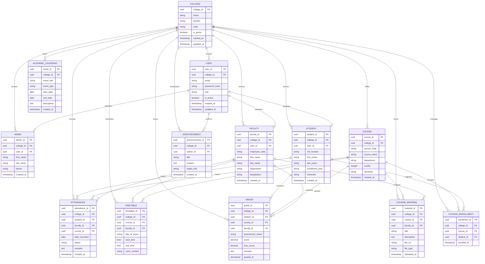

# EduNexa Multi-Tenant Database Architecture

## 1. Architectural Overview & Multi-Tenant Isolation Strategy

EduNexa implements a **Shared Database, Shared Schema with Discriminator Column (`college_id`) & PostgreSQL Row-Level Security (RLS)** architecture.

### Multi-Tenancy Guarantees
* **Tenant Isolation:** Every operational and domain table references `college_id` with a foreign key constraint pointing to the master `COLLEGE` table.
* **Composite Indexing:** High-frequency query paths utilize composite indexes prefixed by `college_id` (e.g., `(college_id, student_id)`, `(college_id, course_id, date_recorded)`) to guarantee tenant data segregation and index partition performance.
* **Cascading Integrity:** Deletion or suspension of a tenant cleanly cascades or deactivates tenant records without leaving orphan records.
* **Row-Level Security (RLS) Policy Blueprint:**
  ```sql
  ALTER TABLE students ENABLE ROW LEVEL SECURITY;
  CREATE POLICY tenant_isolation_policy ON students
    FOR ALL
    USING (college_id = NULLIF(current_setting('app.current_tenant', true), '')::uuid);
  ```

---

## 2. Entity-Relationship (ER) Diagram



---

## 3. Detailed Schema Specifications

### 3.1 Tenant & Identity Tables

#### `colleges` (Tenant Master)
| Column | Type | Constraints | Description |
| :--- | :--- | :--- | :--- |
| `college_id` | `UUID` | `PRIMARY KEY, DEFAULT gen_random_uuid()` | Unique tenant identifier |
| `name` | `VARCHAR(255)` | `NOT NULL` | College institutional name |
| `domain` | `VARCHAR(100)` | `UNIQUE, NOT NULL` | Unique subdomain/custom domain identifier |
| `code` | `VARCHAR(50)` | `UNIQUE, NOT NULL` | Short tenant code (e.g. `MIT`, `STANFORD`) |
| `is_active` | `BOOLEAN` | `DEFAULT TRUE, NOT NULL` | Tenant billing/access status |
| `created_at` | `TIMESTAMPTZ` | `DEFAULT CURRENT_TIMESTAMP, NOT NULL` | Record timestamp |
| `updated_at` | `TIMESTAMPTZ` | `DEFAULT CURRENT_TIMESTAMP, NOT NULL` | Last modification timestamp |

#### `users` (Base Authentication)
| Column | Type | Constraints | Description |
| :--- | :--- | :--- | :--- |
| `user_id` | `UUID` | `PRIMARY KEY, DEFAULT gen_random_uuid()` | Unique user identifier |
| `college_id` | `UUID` | `FOREIGN KEY REFERENCES colleges(college_id) ON DELETE CASCADE, NOT NULL` | Tenant ownership |
| `email` | `VARCHAR(255)` | `NOT NULL` | User email address |
| `password_hash` | `VARCHAR(255)` | `NOT NULL` | Argon2 / Bcrypt password hash |
| `role` | `VARCHAR(20)` | `CHECK (role IN ('ADMIN', 'FACULTY', 'STUDENT')), NOT NULL` | RBAC Role |
| `is_active` | `BOOLEAN` | `DEFAULT TRUE, NOT NULL` | Account status |
| `created_at` | `TIMESTAMPTZ` | `DEFAULT CURRENT_TIMESTAMP, NOT NULL` | Creation timestamp |
| `updated_at` | `TIMESTAMPTZ` | `DEFAULT CURRENT_TIMESTAMP, NOT NULL` | Update timestamp |
| **Unique Index** | — | `UNIQUE (college_id, email)` | Enforces unique email per tenant |

---

### 3.2 Role-Specific Profile Tables

#### `admins` (AG-01)
| Column | Type | Constraints | Description |
| :--- | :--- | :--- | :--- |
| `admin_id` | `UUID` | `PRIMARY KEY, DEFAULT gen_random_uuid()` | Admin profile identifier |
| `college_id` | `UUID` | `FOREIGN KEY REFERENCES colleges(college_id) ON DELETE CASCADE, NOT NULL` | Tenant ownership |
| `user_id` | `UUID` | `FOREIGN KEY REFERENCES users(user_id) ON DELETE CASCADE, UNIQUE, NOT NULL` | User auth reference |
| `first_name` | `VARCHAR(100)` | `NOT NULL` | Admin first name |
| `last_name` | `VARCHAR(100)` | `NOT NULL` | Admin last name |
| `phone` | `VARCHAR(20)` | `NULL` | Contact phone number |
| `created_at` | `TIMESTAMPTZ` | `DEFAULT CURRENT_TIMESTAMP, NOT NULL` | Timestamp |

#### `faculty` (AG-02 / ENT-02)
| Column | Type | Constraints | Description |
| :--- | :--- | :--- | :--- |
| `faculty_id` | `UUID` | `PRIMARY KEY, DEFAULT gen_random_uuid()` | Faculty profile identifier |
| `college_id` | `UUID` | `FOREIGN KEY REFERENCES colleges(college_id) ON DELETE CASCADE, NOT NULL` | Tenant ownership |
| `user_id` | `UUID` | `FOREIGN KEY REFERENCES users(user_id) ON DELETE CASCADE, UNIQUE, NOT NULL` | User auth reference |
| `employee_code`| `VARCHAR(50)` | `NOT NULL` | Faculty staff ID |
| `first_name` | `VARCHAR(100)` | `NOT NULL` | First name |
| `last_name` | `VARCHAR(100)` | `NOT NULL` | Last name |
| `department` | `VARCHAR(100)` | `NOT NULL` | Academic department (e.g. CS, EE) |
| `designation` | `VARCHAR(100)` | `NULL` | Academic rank (e.g. Professor, Lecturer) |
| `created_at` | `TIMESTAMPTZ` | `DEFAULT CURRENT_TIMESTAMP, NOT NULL` | Timestamp |
| **Unique Index** | — | `UNIQUE (college_id, employee_code)` | Unique staff ID per college |

#### `students` (AG-03 / ENT-01)
| Column | Type | Constraints | Description |
| :--- | :--- | :--- | :--- |
| `student_id` | `UUID` | `PRIMARY KEY, DEFAULT gen_random_uuid()` | Student profile identifier |
| `college_id` | `UUID` | `FOREIGN KEY REFERENCES colleges(college_id) ON DELETE CASCADE, NOT NULL` | Tenant ownership |
| `user_id` | `UUID` | `FOREIGN KEY REFERENCES users(user_id) ON DELETE CASCADE, UNIQUE, NOT NULL` | User auth reference |
| `roll_number` | `VARCHAR(50)` | `NOT NULL` | Student institutional roll number |
| `first_name` | `VARCHAR(100)` | `NOT NULL` | First name |
| `last_name` | `VARCHAR(100)` | `NOT NULL` | Last name |
| `enrollment_year`| `VARCHAR(10)` | `NOT NULL` | Year of enrollment (e.g. `2024`) |
| `semester` | `VARCHAR(20)` | `NOT NULL` | Current semester (e.g. `Sem 3`) |
| `created_at` | `TIMESTAMPTZ` | `DEFAULT CURRENT_TIMESTAMP, NOT NULL` | Timestamp |
| **Unique Index** | — | `UNIQUE (college_id, roll_number)` | Unique roll number per college |

---

### 3.3 Academic & Operational Entities

#### `courses`
| Column | Type | Constraints | Description |
| :--- | :--- | :--- | :--- |
| `course_id` | `UUID` | `PRIMARY KEY, DEFAULT gen_random_uuid()` | Course identifier |
| `college_id` | `UUID` | `FOREIGN KEY REFERENCES colleges(college_id) ON DELETE CASCADE, NOT NULL` | Tenant ownership |
| `course_code` | `VARCHAR(50)` | `NOT NULL` | Course code (e.g. `CS101`) |
| `course_name` | `VARCHAR(200)` | `NOT NULL` | Course title |
| `department` | `VARCHAR(100)` | `NOT NULL` | Offering department |
| `credits` | `INTEGER` | `NOT NULL, DEFAULT 3` | Credit count |
| `semester` | `VARCHAR(20)` | `NOT NULL` | Applicable semester |
| `created_at` | `TIMESTAMPTZ` | `DEFAULT CURRENT_TIMESTAMP, NOT NULL` | Timestamp |
| **Unique Index** | — | `UNIQUE (college_id, course_code)` | Unique course code per college |

#### `course_enrollments`
| Column | Type | Constraints | Description |
| :--- | :--- | :--- | :--- |
| `enrollment_id`| `UUID` | `PRIMARY KEY, DEFAULT gen_random_uuid()` | Enrollment record identifier |
| `college_id` | `UUID` | `FOREIGN KEY REFERENCES colleges(college_id) ON DELETE CASCADE, NOT NULL` | Tenant ownership |
| `course_id` | `UUID` | `FOREIGN KEY REFERENCES courses(course_id) ON DELETE CASCADE, NOT NULL` | Enrolled course |
| `student_id` | `UUID` | `FOREIGN KEY REFERENCES students(student_id) ON DELETE CASCADE, NOT NULL` | Enrolled student |
| `enrolled_at` | `TIMESTAMPTZ` | `DEFAULT CURRENT_TIMESTAMP, NOT NULL` | Registration timestamp |
| **Unique Index** | — | `UNIQUE (college_id, course_id, student_id)` | Prevents duplicate enrollments |

#### `attendance` (ENT-03, ENT-04)
| Column | Type | Constraints | Description |
| :--- | :--- | :--- | :--- |
| `attendance_id`| `UUID` | `PRIMARY KEY, DEFAULT gen_random_uuid()` | Attendance log identifier |
| `college_id` | `UUID` | `FOREIGN KEY REFERENCES colleges(college_id) ON DELETE CASCADE, NOT NULL` | Tenant ownership |
| `student_id` | `UUID` | `FOREIGN KEY REFERENCES students(student_id) ON DELETE CASCADE, NOT NULL` | Student |
| `faculty_id` | `UUID` | `FOREIGN KEY REFERENCES faculty(faculty_id) ON DELETE SET NULL, NULL` | Instructor marking record |
| `course_id` | `UUID` | `FOREIGN KEY REFERENCES courses(course_id) ON DELETE CASCADE, NOT NULL` | Target course |
| `date_recorded`| `DATE` | `NOT NULL` | Date of attendance |
| `status` | `VARCHAR(20)` | `CHECK (status IN ('PRESENT', 'ABSENT', 'LATE', 'EXCUSED')), NOT NULL` | Attendance state |
| `remarks` | `TEXT` | `NULL` | Optional note |
| `created_at` | `TIMESTAMPTZ` | `DEFAULT CURRENT_TIMESTAMP, NOT NULL` | Record timestamp |
| **Index** | — | `INDEX (college_id, student_id, date_recorded)` | Fast student personal query |
| **Index** | — | `INDEX (college_id, course_id, date_recorded)` | Fast course aggregate query |

#### `timetable` (ENT-05)
| Column | Type | Constraints | Description |
| :--- | :--- | :--- | :--- |
| `timetable_id` | `UUID` | `PRIMARY KEY, DEFAULT gen_random_uuid()` | Timetable slot identifier |
| `college_id` | `UUID` | `FOREIGN KEY REFERENCES colleges(college_id) ON DELETE CASCADE, NOT NULL` | Tenant ownership |
| `course_id` | `UUID` | `FOREIGN KEY REFERENCES courses(course_id) ON DELETE CASCADE, NOT NULL` | Scheduled course |
| `faculty_id` | `UUID` | `FOREIGN KEY REFERENCES faculty(faculty_id) ON DELETE CASCADE, NOT NULL` | Assigned faculty |
| `day_of_week` | `VARCHAR(15)` | `CHECK (day_of_week IN ('MONDAY','TUESDAY','WEDNESDAY','THURSDAY','FRIDAY','SATURDAY')), NOT NULL` | Day |
| `start_time` | `TIME` | `NOT NULL` | Lecture start |
| `end_time` | `TIME` | `NOT NULL` | Lecture end |
| `room_number` | `VARCHAR(50)` | `NOT NULL` | Classroom / Lab location |
| **Index** | — | `INDEX (college_id, faculty_id, day_of_week)` | Fast faculty schedule lookup |
| **Index** | — | `INDEX (college_id, course_id, day_of_week)` | Fast student schedule lookup |

#### `grades` (ENT-06)
| Column | Type | Constraints | Description |
| :--- | :--- | :--- | :--- |
| `grade_id` | `UUID` | `PRIMARY KEY, DEFAULT gen_random_uuid()` | Grade record identifier |
| `college_id` | `UUID` | `FOREIGN KEY REFERENCES colleges(college_id) ON DELETE CASCADE, NOT NULL` | Tenant ownership |
| `student_id` | `UUID` | `FOREIGN KEY REFERENCES students(student_id) ON DELETE CASCADE, NOT NULL` | Assessed student |
| `course_id` | `UUID` | `FOREIGN KEY REFERENCES courses(course_id) ON DELETE CASCADE, NOT NULL` | Subject course |
| `faculty_id` | `UUID` | `FOREIGN KEY REFERENCES faculty(faculty_id) ON DELETE SET NULL, NULL` | Graded by faculty |
| `assessment_name` | `VARCHAR(100)` | `NOT NULL` | Midterm, Final, Quiz 1, etc. |
| `score` | `NUMERIC(5, 2)` | `NOT NULL` | Awarded marks |
| `max_score` | `NUMERIC(5, 2)` | `NOT NULL, DEFAULT 100.00` | Total maximum score |
| `remarks` | `TEXT` | `NULL` | Faculty feedback |
| `graded_at` | `TIMESTAMPTZ` | `DEFAULT CURRENT_TIMESTAMP, NOT NULL` | Submission timestamp |
| **Index** | — | `INDEX (college_id, student_id, course_id)` | Fast student report lookup |

#### `course_materials` (ENT-07)
| Column | Type | Constraints | Description |
| :--- | :--- | :--- | :--- |
| `material_id` | `UUID` | `PRIMARY KEY, DEFAULT gen_random_uuid()` | Resource identifier |
| `college_id` | `UUID` | `FOREIGN KEY REFERENCES colleges(college_id) ON DELETE CASCADE, NOT NULL` | Tenant ownership |
| `course_id` | `UUID` | `FOREIGN KEY REFERENCES courses(course_id) ON DELETE CASCADE, NOT NULL` | Subject course |
| `faculty_id` | `UUID` | `FOREIGN KEY REFERENCES faculty(faculty_id) ON DELETE CASCADE, NOT NULL` | Uploading faculty |
| `title` | `VARCHAR(200)` | `NOT NULL` | Document title |
| `description` | `TEXT` | `NULL` | Overview / syllabus notes |
| `file_url` | `VARCHAR(500)` | `NOT NULL` | Storage URL / path |
| `file_type` | `VARCHAR(50)` | `NOT NULL` | PDF, DOCX, ZIP, etc. |
| `uploaded_at` | `TIMESTAMPTZ` | `DEFAULT CURRENT_TIMESTAMP, NOT NULL` | Upload timestamp |
| **Index** | — | `INDEX (college_id, course_id)` | Fast course material list |

#### `announcements` (ENT-08)
| Column | Type | Constraints | Description |
| :--- | :--- | :--- | :--- |
| `announcement_id`| `UUID` | `PRIMARY KEY, DEFAULT gen_random_uuid()` | Announcement identifier |
| `college_id` | `UUID` | `FOREIGN KEY REFERENCES colleges(college_id) ON DELETE CASCADE, NOT NULL` | Tenant ownership |
| `author_id` | `UUID` | `FOREIGN KEY REFERENCES users(user_id) ON DELETE SET NULL, NULL` | Admin / Faculty author |
| `title` | `VARCHAR(255)` | `NOT NULL` | Notice title |
| `content` | `TEXT` | `NOT NULL` | Markdown or HTML notice body |
| `target_role` | `VARCHAR(20)` | `CHECK (target_role IN ('ALL', 'FACULTY', 'STUDENT')), DEFAULT 'ALL', NOT NULL` | Audience filter |
| `created_at` | `TIMESTAMPTZ` | `DEFAULT CURRENT_TIMESTAMP, NOT NULL` | Publish timestamp |
| **Index** | — | `INDEX (college_id, created_at DESC)` | Fast reverse-chronological feed |

#### `academic_calendar` (ENT-09)
| Column | Type | Constraints | Description |
| :--- | :--- | :--- | :--- |
| `event_id` | `UUID` | `PRIMARY KEY, DEFAULT gen_random_uuid()` | Calendar event identifier |
| `college_id` | `UUID` | `FOREIGN KEY REFERENCES colleges(college_id) ON DELETE CASCADE, NOT NULL` | Tenant ownership |
| `event_title` | `VARCHAR(200)` | `NOT NULL` | Event title (e.g. End Semester Exam) |
| `event_type` | `VARCHAR(30)` | `CHECK (event_type IN ('EXAM', 'HOLIDAY', 'EVENT', 'WORKSHOP')), NOT NULL` | Event category |
| `start_date` | `DATE` | `NOT NULL` | Event start date |
| `end_date` | `DATE` | `NOT NULL` | Event end date |
| `description` | `TEXT` | `NULL` | Optional details |
| `created_at` | `TIMESTAMPTZ` | `DEFAULT CURRENT_TIMESTAMP, NOT NULL` | Creation timestamp |
| **Index** | — | `INDEX (college_id, start_date, end_date)` | Fast date range lookup |

---

## 4. Multi-Tenant Indexing & Optimization Summary

1. **Tenant Filtering:** Every operational query includes `WHERE college_id = :tenant_id`. All critical access patterns use compound indexes where `college_id` is the leading column.
2. **Cascading Soft / Hard Deletes:** All foreign keys to `colleges(college_id)` specify `ON DELETE CASCADE`. If a tenant is removed or offboarded, child data is pruned safely without orphan records.
3. **Database-Level Row Security:** In addition to application-level tenant isolation, PostgreSQL's `ENABLE ROW LEVEL SECURITY` can be activated across all tables using session context (`SET LOCAL app.current_tenant = '...'`).