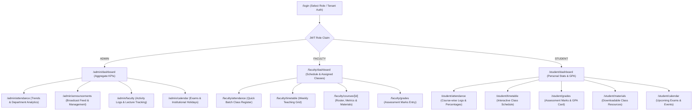

# EduNexa Frontend Specification Document (`frontend_spec.md`)

**Project:** EduNexa — Integrated Academic Management & Student Services System  
**Framework:** Next.js 14+ (App Router, TypeScript, Tailwind CSS, shadcn/ui)  
**State & Data Layer:** TanStack React Query v5 + Axios Interceptors  
**Design Standard:** Modern Institutional Enterprise UI / Glassmorphic Minimalist  
**Target Backend:** EduNexa Multi-Tenant FastAPI REST API (`http://localhost:8000/api/v1`)  

---

## 1. Executive Summary & Design System

EduNexa is a role-based, multi-tenant academic management portal providing dedicated workflows for **Admins**, **Faculty**, and **Students**. The frontend leverages Next.js App Router for server-driven layout composition and dynamic client dashboards styled using **Tailwind CSS** and **shadcn/ui**, elevated with micro-interactions and animations inspired by **reactbits.dev**.

### 1.1 Color Palette & Visual Identity

The design system uses a curated semantic slate/indigo palette engineered for high readability, visual hierarchy, and seamless light/dark mode transitions:

| Token | Hex / HSL | Application | Role |
| :--- | :--- | :--- | :--- |
| **Primary (Brand Navy)** | `#0F172A` / `hsl(222, 47%, 11%)` | Primary navigation, headers, dark theme base | Base structure & authority |
| **Accent Primary (Royal)** | `#2563EB` / `hsl(221, 83%, 53%)` | Action buttons, active navigation, focus rings | Primary call-to-action |
| **Accent Secondary (Violet)** | `#7C3AED` / `hsl(262, 83%, 58%)` | Badges, gradient highlights, analytics accents | Creative & secondary emphasis |
| **Success (Emerald)** | `#10B981` / `hsl(142, 71%, 45%)` | Present attendance, passing grades, online status | Positive metrics & confirmations |
| **Warning (Amber)** | `#F59E0B` / `hsl(38, 92%, 50%)` | Late attendance, upcoming deadlines, exam alerts | Attention & cautions |
| **Destructive (Rose)** | `#EF4444` / `hsl(0, 84%, 60%)` | Absent attendance, critical warnings, delete actions | Negative metrics & errors |
| **Background (Light/Dark)** | `#F8FAFC` / `#090D16` | Application canvas background | Contrast balance |
| **Card Surface (Glass)** | `rgba(255, 255, 255, 0.8)` / `rgba(15, 23, 42, 0.75)` | Dashboard cards, popovers, modal backdrops | Glassmorphic depth |

### 1.2 Typography & Layout Tokens
- **Font Primary:** `Inter` (UI elements, data tables, metrics)
- **Font Heading / Accent:** `Outfit` (Portal headings, welcome banners, high-impact numbers)
- **Border Radius:** Default `rounded-xl` (12px) for cards, `rounded-lg` (8px) for buttons/inputs.
- **Glassmorphic Filter:** `backdrop-blur-md border border-white/10 dark:border-white/5 shadow-sm`

---

## 2. Component System (shadcn/ui)

EduNexa utilizes an atomic component architecture based on **shadcn/ui** (Radix UI primitives):

```
components/
├── ui/                     # shadcn/ui base primitives
│   ├── button.tsx
│   ├── card.tsx
│   ├── dialog.tsx
│   ├── dropdown-menu.tsx
│   ├── input.tsx
│   ├── select.tsx
│   ├── table.tsx
│   ├── tabs.tsx
│   ├── badge.tsx
│   ├── progress.tsx
│   ├── calendar.tsx
│   ├── sheet.tsx
│   ├── sonner.tsx          # Toast notifications
│   ├── skeleton.tsx        # Loading state placeholders
│   └── tooltip.tsx
├── shared/                 # Cross-portal reusable components
│   ├── AppSidebar.tsx      # Role-aware collapsible sidebar
│   ├── HeaderBar.tsx       # Profile, tenant switcher, theme toggle
│   ├── MetricCard.tsx      # KPI stat cards with trend indicators
│   ├── NoticeCard.tsx      # Announcement cards
│   └── DataTable.tsx       # TanStack Table wrapper with search & pagination
└── animations/             # reactbits.dev animated UI components
    ├── SpotlightCard.tsx
    ├── DecryptedText.tsx
    └── AnimatedList.tsx
```

### Component Catalog by Functional Area

* **Navigation & Scaffolding:** `Sidebar`, `Breadcrumb`, `DropdownMenu`, `Tabs`, `Separator`
* **Data Display & KPI Metrics:** `Card`, `Table`, `Badge`, `Avatar`, `Progress`, `Tooltip`
* **Forms & Filtering:** `Form` (React Hook Form + Zod), `Input`, `Select`, `DatePicker`, `Textarea`, `Checkbox`
* **Feedback & Overlays:** `Dialog`, `AlertDialog`, `Sheet` (Side drawers for timetable slots and material upload), `Sonner` (Toasts), `Skeleton`

---

## 3. UI Micro-Animations (reactbits.dev Integration)

To elevate EduNexa from a standard portal to a high-end enterprise experience, we integrate three specific components and animation patterns from **reactbits.dev**:

### 1. `SpotlightCard` (Cards & Metrics)
* **Library Reference:** `reactbits.dev/components/spotlight-card`
* **Usage:** Applied to all dashboard KPI Metric Cards (Aggregate Attendance, Total Students, GPA Display) and Course Cards.
* **Effect:** A radial gradient spotlight follows the user’s cursor dynamically across the card surface with subtle border illumination, creating interactive visual depth without distracting from data.
* **Component Code Blueprint:**
  ```tsx
  // components/animations/SpotlightCard.tsx
  "use client";
  import React, { useRef, useState } from "react";

  export const SpotlightCard = ({ children, className = "", spotlightColor = "rgba(37, 99, 235, 0.15)" }) => {
    const divRef = useRef<HTMLDivElement>(null);
    const [position, setPosition] = useState({ x: 0, y: 0, opacity: 0 });

    const handleMouseMove = (e: React.MouseEvent<HTMLDivElement>) => {
      if (!divRef.current) return;
      const rect = divRef.current.getBoundingClientRect();
      setPosition({ x: e.clientX - rect.left, y: e.clientY - rect.top, opacity: 1 });
    };

    return (
      <div
        ref={divRef}
        onMouseMove={handleMouseMove}
        onMouseLeave={() => setPosition((p) => ({ ...p, opacity: 0 }))}
        className={`relative overflow-hidden rounded-xl border border-slate-200/80 bg-white dark:border-slate-800 dark:bg-slate-900/60 shadow-sm ${className}`}
      >
        <div
          className="pointer-events-none absolute -inset-px transition-opacity duration-300"
          style={{
            opacity: position.opacity,
            background: `radial-gradient(600px circle at ${position.x}px ${position.y}px, ${spotlightColor}, transparent 40%)`,
          }}
        />
        <div className="relative z-10">{children}</div>
      </div>
    );
  };
  ```

### 2. `DecryptedText` / Scramble Reveal (Hero Metrics & Headers)
* **Library Reference:** `reactbits.dev/text-animations/decrypted-text`
* **Usage:** Applied to the main dashboard welcome header (`"Welcome back, Dr. Alan Turing"`) and high-impact GPA / Attendance rate counters on initial page load.
* **Effect:** Characters rapidly cycle through randomized glyphs before settling on the target text, giving an authentic high-tech institutional feel.

### 3. `AnimatedList` (Announcements Feed & Activity Logs)
* **Library Reference:** `reactbits.dev/components/animated-list`
* **Usage:** Institutional Notice Board feed (`/announcements`) and Faculty Attendance Log streams.
* **Effect:** Items cascade into view with staggered spring physics (`framer-motion`) and subtle opacity scaling as data streams in from React Query.

---

## 4. Screens & Step-by-Step User Flows



---

### 4.1 Authentication Flow (`/login`)
1. **Screen Layout:** Centered split-screen layout. Left panel features institutional branding with an ambient gradient backdrop; right panel contains the login form.
2. **Inputs:** `Email`, `Password`, optional `Tenant Subdomain / ID` selector.
3. **Execution:**
   - User submits credentials ➔ `POST /api/v1/auth/login`.
   - On success, the response sets the JWT in an `HttpOnly` cookie or encrypted local storage.
   - User context initializes via `GET /api/v1/auth/me`.
   - Router automatically redirects based on role:
     - `ADMIN` ➔ `/admin/dashboard`
     - `FACULTY` ➔ `/faculty/dashboard`
     - `STUDENT` ➔ `/student/dashboard`

---

### 4.2 Admin Portal Navigation & Screens

#### Screen 1: Admin Overview Dashboard (`/admin/dashboard`)
* **Step 1:** Top header displays college name, active academic term, and current session date.
* **Step 2:** Spotlight KPI Grid displays:
  - Total Enrolled Students (Count)
  - Active Faculty Members (Count)
  - College-Wide Attendance Rate (Percentage badge with warning color if < 75%)
  - Total Active Notices Published
* **Step 3:** Quick Activity Feed shows recent faculty lecture submissions and latest calendar milestones.

#### Screen 2: College-Wide Attendance Analytics (`/admin/attendance`) — **ADM-01**
* **Step 1:** Top navigation allows switching between **Summary Table** and **Trend Analytics**.
* **Step 2:** Summary tab renders a searchable, sortable `DataTable` of all courses, displaying enrolled counts, total recorded classes, present percentages, and department badges.
* **Step 3:** Trends tab renders time-series area charts (via Recharts) tracking daily attendance fluctuations across departments (Computer Science, Electronics, Mechanical).

#### Screen 3: Institutional Notice Board (`/admin/announcements`) — **ADM-02**
* **Step 1:** Renders list of current announcements with target audience badges (`ALL`, `FACULTY`, `STUDENT`).
* **Step 2:** **Publish Notice Dialog** (Triggered via `+ New Announcement` button):
  - Form fields: `Title`, `Target Role` (Dropdown), `Content` (Markdown editor).
  - Submits to `POST /api/v1/admin/announcements`.
* **Step 3:** Inline actions to **Edit** (`PUT /api/v1/admin/announcements/{id}`) or **Delete** with confirmation dialog.

#### Screen 4: Faculty Productivity & Activity Logs (`/admin/faculty`) — **ADM-03**
* **Step 1:** Grid of faculty cards displaying department, scheduled class count, attendance sessions recorded, and material uploads.
* **Step 2:** Clicking any faculty member opens a slide-over `Sheet` displaying their chronological attendance logging history (`GET /api/v1/admin/faculty/{id}/attendance-logs`).

#### Screen 5: Academic Calendar Management (`/admin/calendar`) — **ENT-09**
* **Step 1:** Monthly calendar view highlighting upcoming events color-coded by event type:
  - 🔴 `EXAM`
  - 🟢 `HOLIDAY`
  - 🔵 `EVENT` / `WORKSHOP`
* **Step 2:** Modal dialog to create new calendar events (`POST /api/v1/admin/academic-calendar`).

---

### 4.3 Faculty Portal Navigation & Screens

#### Screen 1: Faculty Home Dashboard (`/faculty/dashboard`)
* **Step 1:** Dynamic greeting (`"Good morning, Professor..."`) with `DecryptedText` animation.
* **Step 2:** **Today's Classes at a Glance:** Cards showing current day lectures with room numbers and start/end countdowns.
* **Step 3:** One-click `"Mark Attendance"` action button next to active lectures.

#### Screen 2: Attendance Marking Station (`/faculty/attendance`) — **FAC-01, FAC-03**
* **Step 1:** Course and date selector (`Select Course`, `Date Picker` defaulting to today).
* **Step 2:** On course selection, the student roster automatically loads (`GET /api/v1/faculty/courses/{course_id}/students`).
* **Step 3:** Roster table with quick-toggle buttons for each student:
  - `[P] Present` (Green) | `[A] Absent` (Red) | `[L] Late` (Amber) | `[E] Excused`
* **Step 4:** Top bulk-action controls: `"Mark All Present"`, `"Mark All Absent"`.
* **Step 5:** Optional `Remarks` field per student.
* **Step 6:** Click `"Submit Attendance"` ➔ fires `POST /api/v1/faculty/{id}/attendance` with batch payload. Displays success toast via `Sonner`.

#### Screen 3: Teaching Timetable (`/faculty/timetable`) — **FAC-02**
* **Step 1:** Weekly visual grid (Monday through Saturday, 8:00 AM – 6:00 PM).
* **Step 2:** Lecture blocks color-coded by course, displaying `Course Code`, `Course Name`, `Room Number`, and duration.
* **Step 3:** Clicking any slot displays class student enrollment metrics and direct navigation to syllabus materials.

#### Screen 4: Assessment Marks Entry (`/faculty/grades`) — **FAC-04**
* **Step 1:** Select target course and input `Assessment Name` (e.g., "Midterm Exam", "Assignment 1", "Quiz 2") and `Max Marks` (default 100).
* **Step 2:** Auto-populated student grid with score input boxes and input validation (`0 <= score <= max_score`).
* **Step 3:** Real-time class average and highest score calculation displayed in the footer bar.
* **Step 4:** Click `"Publish Grades"` ➔ executes `POST /api/v1/faculty/{id}/marks`.

#### Screen 5: Digital Course Materials Manager (`/faculty/materials`) — **FAC-05**
* **Step 1:** Filter tabs by assigned course.
* **Step 2:** Drag-and-drop file upload dialog (`Title`, `Course`, `Description`, `File URL / Type`).
* **Step 3:** Cards list of uploaded materials with download links and delete action (`DELETE /api/v1/faculty/materials/{id}`).

---

### 4.4 Student Portal Navigation & Screens

#### Screen 1: Student Home Dashboard (`/student/dashboard`)
* **Step 1:** Overview cards:
  - **Overall Attendance Gauge:** Circular progress bar showing total attendance % (Flagged red if under 75% institutional threshold).
  - **Semester GPA / Progress:** Large display card with letter grade badge (`A`, `B`, `C`).
  - **Next Upcoming Lecture:** Timetable slot countdown with room number.
* **Step 2:** Feed of recent institutional notices and upcoming examination milestones.

#### Screen 2: Attendance Tracker (`/student/attendance`) — **STD-01**
* **Step 1:** Subject-by-subject breakdown cards:
  - Course Code & Name
  - Attended Classes / Total Classes conducted
  - Percentage progress bar with status badge (`On Track` vs `Shortage Alert`)
* **Step 2:** Clicking any subject expands the full date-by-date session log (`GET /api/v1/student/{id}/attendance/{course_id}`), showing the exact dates marked `PRESENT`, `ABSENT`, or `LATE` with instructor remarks.

#### Screen 3: Class Timetable (`/student/timetable`) — **STD-02**
* **Step 1:** Responsive schedule layout (Weekly grid on desktop, swipeable day-tabs on mobile).
* **Step 2:** Displays class timing, room number, course title, and teaching faculty name.

#### Screen 4: Grades & Academic Report Card (`/student/grades`) — **STD-03**
* **Step 1:** Academic progress summary: Semester credit-weighted GPA calculation.
* **Step 2:** Grade book table displaying `Course`, `Assessment Title`, `Score / Max Score`, calculated `Percentage`, and faculty remarks.

#### Screen 5: Digital Course Materials Library (`/student/materials`) — **STD-04**
* **Step 1:** Grouped by enrolled subjects.
* **Step 2:** Document cards showing title, file extension badge (PDF, DOCX, ZIP), upload date, and direct download buttons.

#### Screen 6: Academic Calendar & Notice Board (`/student/calendar`, `/student/announcements`) — **STD-05, STD-06**
* **Step 1:** Calendar highlighting upcoming exam dates and institutional holidays.
* **Step 2:** Campus notice feed with filters for general notices vs student-specific advisories.

---

## 5. Client-Side Caching Strategy (TanStack React Query v5)

To ensure instant screen transitions, zero redundant network calls, and automatic background cache synchronization, EduNexa implements **TanStack React Query v5**.

### 5.1 Query Client Configuration
```typescript
// lib/queryClient.ts
import { QueryClient } from "@tanstack/react-query";

export const queryClient = new QueryClient({
  defaultOptions: {
    queries: {
      staleTime: 1000 * 60 * 3,        // Data remains fresh for 3 minutes
      gcTime: 1000 * 60 * 15,          // Unused data garbage-collected after 15 minutes
      refetchOnWindowFocus: true,      // Auto-revalidate when switching back to tab
      retry: (failureCount, error: any) => {
        // Do not retry 401 Unauthorized or 403 Forbidden errors
        if (error?.response?.status === 401 || error?.response?.status === 403) return false;
        return failureCount < 2;
      },
    },
  },
});
```

### 5.2 Structured Query Key Factory
A centralized query key factory prevents cache collisions and enables granular cache invalidation:

```typescript
// lib/queryKeys.ts
export const queryKeys = {
  auth: {
    me: ["auth", "me"] as const,
  },
  admin: {
    attendanceSummary: (collegeId: string) => ["admin", collegeId, "attendance", "summary"] as const,
    attendanceTrends: (collegeId: string) => ["admin", collegeId, "attendance", "trends"] as const,
    facultyActivity: (collegeId: string) => ["admin", collegeId, "faculty", "activity"] as const,
    facultyLogs: (collegeId: string, facultyId: string) => ["admin", collegeId, "faculty", facultyId, "logs"] as const,
    announcements: (collegeId: string, role?: string) => ["admin", collegeId, "announcements", role] as const,
    calendar: (collegeId: string) => ["admin", collegeId, "calendar"] as const,
  },
  faculty: {
    timetable: (facultyId: string) => ["faculty", facultyId, "timetable"] as const,
    courses: (facultyId: string) => ["faculty", facultyId, "courses"] as const,
    courseStudents: (courseId: string) => ["faculty", "courses", courseId, "students"] as const,
    courseMetrics: (courseId: string) => ["faculty", "courses", courseId, "metrics"] as const,
    grades: (courseId: string) => ["faculty", "courses", courseId, "grades"] as const,
    materials: (courseId: string) => ["faculty", "courses", courseId, "materials"] as const,
    announcements: (collegeId: string) => ["faculty", collegeId, "announcements"] as const,
  },
  student: {
    attendanceSummary: (studentId: string) => ["student", studentId, "attendance", "summary"] as const,
    attendanceDetail: (studentId: string, courseId: string) => ["student", studentId, "attendance", courseId] as const,
    timetable: (studentId: string) => ["student", studentId, "timetable"] as const,
    grades: (studentId: string) => ["student", studentId, "grades"] as const,
    progressReport: (studentId: string) => ["student", studentId, "progressReport"] as const,
    courses: (studentId: string) => ["student", studentId, "courses"] as const,
    materials: (studentId: string) => ["student", studentId, "materials"] as const,
    calendar: (collegeId: string) => ["student", collegeId, "calendar"] as const,
    announcements: (collegeId: string) => ["student", collegeId, "announcements"] as const,
  },
};
```

### 5.3 Optimistic Updates & Cache Invalidation Patterns
* **Attendance Submission (Faculty):** Upon submitting `POST /api/v1/faculty/{id}/attendance`, the client immediately invalidates `queryKeys.faculty.courseMetrics(courseId)` and triggers background refetch for admin summary views.
* **Announcements Posting (Admin):** Submitting a notice optimistic-prepends the new announcement into the list before server response, and invalidates all announcement queries across all roles.

---

## 6. End-to-End API Integration & Dashboard Plug-in Matrix

This matrix maps every frontend screen, user trigger, and data visualization directly to the EduNexa backend endpoints:

| Portal & Screen | User Action / Trigger | HTTP Method & Route | Query Key / Cache Target | Cache Invalidation Triggered |
| :--- | :--- | :--- | :--- | :--- |
| **All / Login** | Submit credentials | `POST /api/v1/auth/login` | — | Sets JWT token; preloads `auth.me` |
| **All / Session** | App mount / Route guard | `GET /api/v1/auth/me` | `queryKeys.auth.me` | On logout / 401 token expiry |
| **Admin / Dashboard** | Load overview page | `GET /api/v1/admin/attendance/summary` | `admin.attendanceSummary(collegeId)` | Refetches on 3-minute stale window |
| **Admin / Attendance** | View trend graphs | `GET /api/v1/admin/attendance/trends` | `admin.attendanceTrends(collegeId)` | Periodically polled |
| **Admin / Notices** | View institutional feed | `GET /api/v1/admin/announcements` | `admin.announcements(collegeId)` | After notice create/delete |
| **Admin / Notices** | Click "Publish Announcement" | `POST /api/v1/admin/announcements` | Mutation | Invalidates all role announcement feeds |
| **Admin / Notices** | Edit notice | `PUT /api/v1/admin/announcements/{id}` | Mutation | Invalidates `admin.announcements` |
| **Admin / Notices** | Delete notice | `DELETE /api/v1/admin/announcements/{id}`| Mutation | Invalidates `admin.announcements` |
| **Admin / Faculty** | View faculty productivity | `GET /api/v1/admin/faculty/activity` | `admin.facultyActivity(collegeId)` | Stale time 5 mins |
| **Admin / Faculty** | Open faculty log sheet | `GET /api/v1/admin/faculty/{id}/attendance-logs` | `admin.facultyLogs(collegeId, id)` | On drawer open |
| **Admin / Calendar** | Create calendar event | `POST /api/v1/admin/academic-calendar` | Mutation | Invalidates `admin.calendar`, `student.calendar` |
| **Faculty / Home** | Page mount | `GET /api/v1/faculty/{id}/timetable` | `faculty.timetable(facultyId)` | Stale time 10 mins |
| **Faculty / Home** | Load assigned classes | `GET /api/v1/faculty/{id}/courses` | `faculty.courses(facultyId)` | Stale time 15 mins |
| **Faculty / Attendance** | Select course dropdown | `GET /api/v1/faculty/courses/{course_id}/students` | `faculty.courseStudents(courseId)` | Stale time 10 mins |
| **Faculty / Attendance** | Click "Submit Attendance" | `POST /api/v1/faculty/{id}/attendance` | Mutation | Invalidates `courseMetrics`, `admin.attendanceSummary` |
| **Faculty / Attendance** | Edit record inline | `PUT /api/v1/faculty/attendance/{attendance_id}` | Mutation | Invalidates `courseMetrics` |
| **Faculty / Grades** | View current grades | `GET /api/v1/faculty/courses/{course_id}/grades` | `faculty.grades(courseId)` | After grade upload |
| **Faculty / Grades** | Click "Publish Grades" | `POST /api/v1/faculty/{id}/marks` | Mutation | Invalidates `faculty.grades`, `student.grades` |
| **Faculty / Materials**| Click "Upload Material" | `POST /api/v1/faculty/materials` | Mutation | Invalidates `faculty.materials`, `student.materials` |
| **Faculty / Materials**| Remove file | `DELETE /api/v1/faculty/materials/{id}` | Mutation | Invalidates `faculty.materials` |
| **Faculty / Notices** | View notices tab | `GET /api/v1/faculty/announcements` | `faculty.announcements(collegeId)` | Background revalidation |
| **Student / Home** | Page mount | `GET /api/v1/student/{id}/attendance` | `student.attendanceSummary(studentId)` | Stale time 2 mins |
| **Student / Home** | Page mount | `GET /api/v1/student/{id}/progress-report` | `student.progressReport(studentId)` | Stale time 5 mins |
| **Student / Attendance**| Expand course row | `GET /api/v1/student/{id}/attendance/{course_id}` | `student.attendanceDetail(studentId, courseId)` | On accordion expand |
| **Student / Timetable** | View lecture schedule | `GET /api/v1/student/{id}/timetable` | `student.timetable(studentId)` | Stale time 15 mins |
| **Student / Grades** | View detailed marks card | `GET /api/v1/student/{id}/grades` | `student.grades(studentId)` | Stale time 5 mins |
| **Student / Courses** | View enrolled list | `GET /api/v1/student/{id}/courses` | `student.courses(studentId)` | Stale time 15 mins |
| **Student / Materials**| View class notes | `GET /api/v1/student/{id}/materials` | `student.materials(studentId)` | Stale time 5 mins |
| **Student / Calendar** | View exams & holidays | `GET /api/v1/student/academic-calendar` | `student.calendar(collegeId)` | Stale time 15 mins |
| **Student / Notices** | View campus announcements | `GET /api/v1/student/announcements` | `student.announcements(collegeId)` | Background revalidation |

---

## 7. Recommended Directory Structure for Next.js App Router

```text
frontend/
├── app/
│   ├── (auth)/
│   │   └── login/
│   │       └── page.tsx
│   ├── (dashboard)/
│   │   ├── layout.tsx              # Sidebar + Header container layout
│   │   ├── admin/
│   │   │   ├── dashboard/page.tsx
│   │   │   ├── attendance/page.tsx
│   │   │   ├── announcements/page.tsx
│   │   │   ├── faculty/page.tsx
│   │   │   └── calendar/page.tsx
│   │   ├── faculty/
│   │   │   ├── dashboard/page.tsx
│   │   │   ├── attendance/page.tsx
│   │   │   ├── timetable/page.tsx
│   │   │   ├── grades/page.tsx
│   │   │   └── materials/page.tsx
│   │   └── student/
│   │       ├── dashboard/page.tsx
│   │       ├── attendance/page.tsx
│   │       ├── timetable/page.tsx
│   │       ├── grades/page.tsx
│   │       ├── materials/page.tsx
│   │       └── calendar/page.tsx
│   ├── layout.tsx                  # Root layout with QueryClientProvider & ThemeProvider
│   └── page.tsx                    # Landing / Auto-redirect to /login or role dashboard
├── components/
│   ├── ui/                         # shadcn/ui components
│   ├── shared/                     # Reusable layout and data table components
│   └── animations/                 # reactbits components (SpotlightCard, etc.)
├── hooks/
│   ├── useAuth.ts                  # Login, logout, session state
│   ├── useAdmin.ts                 # React Query hooks for Admin
│   ├── useFaculty.ts               # React Query hooks for Faculty
│   └── useStudent.ts               # React Query hooks for Student
├── lib/
│   ├── api.ts                      # Axios instance with Bearer & X-Tenant-ID interceptors
│   ├── queryClient.ts              # React Query client configuration
│   └── queryKeys.ts                # Centralized query keys factory
└── styles/
    └── globals.css                 # Tailwind CSS & glassmorphic tokens
```
